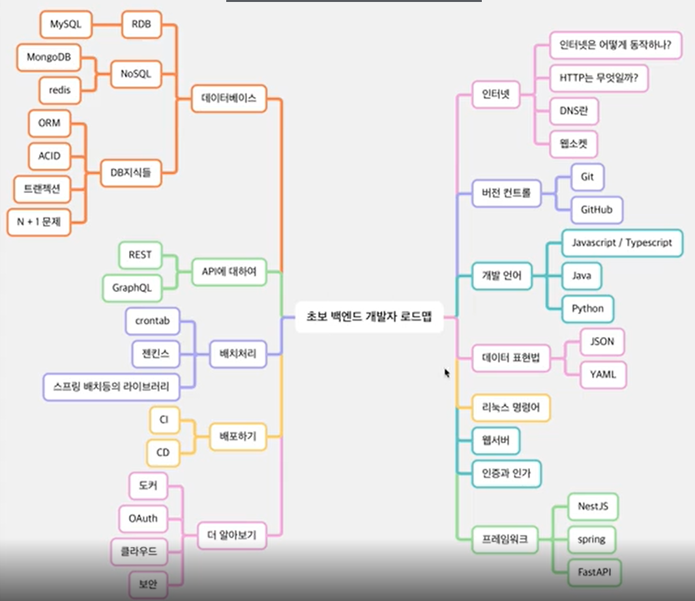

# 개요

백엔드 개발자가 되기위해 알아야 하는 것  
[로드맵 링크](https://roadmap.sh/backend)

Internet
- 인터넷이 어떻게 작동하는가
- HTTP가 무엇인가
- 브라우저는 어떻게 작동하는가
- DNS는 무엇이고 어떻게 동작하고
- 도메인 네임은 무엇인가
- 호스팅이 무엇인가

Learn a Language
- java, C#, PHP...

Version Control System
- Git  

Repo hosting services  
- Github, GitLab

OS and General Knowledge  
Relational Databases
- MySQL, MariaDB ..

NoSQL Database  
- MongoDB, Firebase..

Learn about API  

Caching  

Web Security Knowledge  

Testing  

CI/CD  

Software Design & Architecture  
Design and Development Principles  

Architectural Patterns  

Message Brokers  
Containerization vs Virtualization  

GraphQL  
WebSockets  
Server Sent Events  
WebServers  
Building for Scale  

End  

## 요약, 초보 개발자 로드맵

초보개발자
- 도움을 조금 받으면 자기에게 맡은 일을 할 수 있는 개발자

