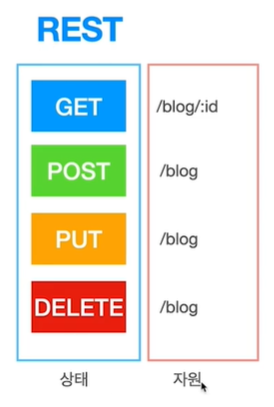
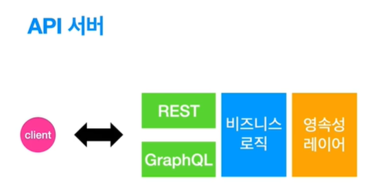

# API에 대하여


API는 REST방식으로 작성한다.  
GraphQL, GRPC도 사용한다.  

REST
- Representational State Transfer, 표현적 상태 전달자
- 자원의 표현에 의한 상태 전달
- 자원은 HTTP URI 방식으로 자원을 표현  
- 자원에 대한 상태를 변경하고 싶을 때 상태를 전달할 건데 그 상태를 POST, GET, PUT, DELETE와 같은 HTTP 메서드를 사용해서 해당 자원에 대한 상태를 전달할 수 있게 해주는 것을 REST라고 한다.



- 자원에 대한 상태를 변경하고 싶을 때는 GET POST PUT DELETE를 사용한다.
- 자원은 그대로 있는다.
- GET: Data를 가져온다.
- POST: Data를 추가한다.
- PUT: Data를 수정, 업데이트한다.
- DELETE: Data를 삭제한다. 

GraphQL 
- Graph Query Language
- 쿼리언어 스펙
- 클라이언트가 서버로부터 데이터를 효과적으로 가져오게 하는 것이 목적
- endpoint가 하나만 있음
- REST API는 각각의 URL을 만들어주지만 GraphQL은 URL이 단 하나고 쿼리를 어떻게 작성하느냐에 따라 데이터를 어떤 가져올지를 결정한다.
```json
{
    user(id: "1000"){
        name
        createDt
    }
}
```

현업  


- 현업에서는 보통 하나만 쓰지 않고 둘다쓴다.
- 클라이언트가 요청을 보내면 REST를 사용할 때도 있고 GraphQL을 사용할 때도 있다.
- REST에 비해서는 GraphQL은 보안적인 부분이나 성능적인 부분이 만족되어야 하기 때문에 그런 부분이 만족이 안된다면 REST를 쓴다.


