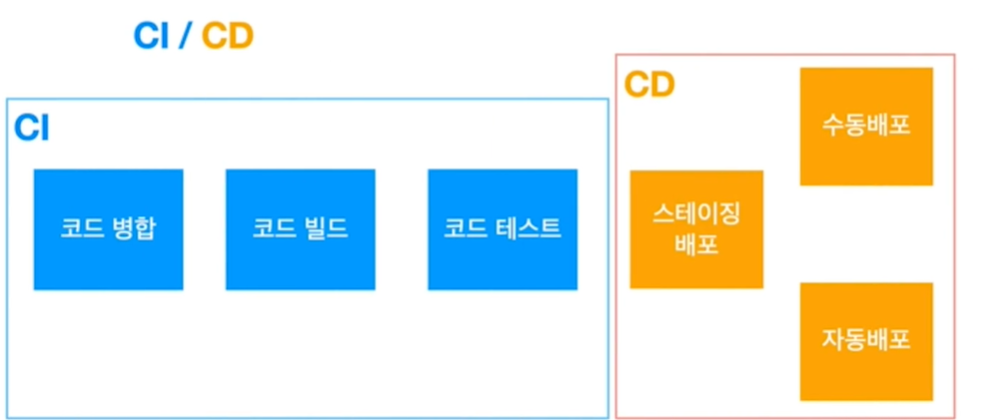

# 배포하기

개발부터 그 이후의 과정부터 배포가 될 때까지의 모든 업무  
배포도구를 이용해서 배포를 진행할 것이다.  

배포는 반복적이고 단순한 작업이지만 절대로 실수하면 안되는 매우 중요한 작업이기 때문에 도구를 사용하는 것이 좋다.  

스크립트를 사용해서 배포를 할 수 있다.  
ansible, 엔포 등이 있다.  

스크립트를 실행해주는 도구를 사용한다.    
젠킨스 CircleCID, github action, ArgoCD같은 프로그램들이 있다.  

CI/CD
- 컨티뉴어스라는 단어가 붙은 지속적으로 통합하고 지속적으로 배포한다.

- CI는 배포전의 과정을 자동하는 것을 뜻한다.
- 코드를 병합하면 그 병합된 코드대로 코드를 빌드하고 코드를 테스트하고 가능하다면 정적 분석 등을 돌려준다. 이러한 작업들을 자동화해주는 것이 CI이다.
- CD는 배포하는 것을 고도화하는 것을 말한다.
- 서버 여러대에 나눠서 배포하는 경우에는 다양한 전략들을 쓸 수 있다.
- 롤링 배포는 서버 여러대 중에 몇 대만 계속 돌아가면서 배포
- 똑같은 수의 서버를 미리 다 띄워두고 주소만 바꿔치기하는 블루/그린 배포도 있다.
- 특정 퍼센트의 서버에만 배포한 다음 문제가없으면 점차 배포를 늘려가는 까나리 배포도 있다.  

결론적으로 배포하기라고 하는 것은 코드를 작성한 이후에 코드가 정말로 서버에 나갈 때 까지의 모든 활동을 자동화하는 것이다.

